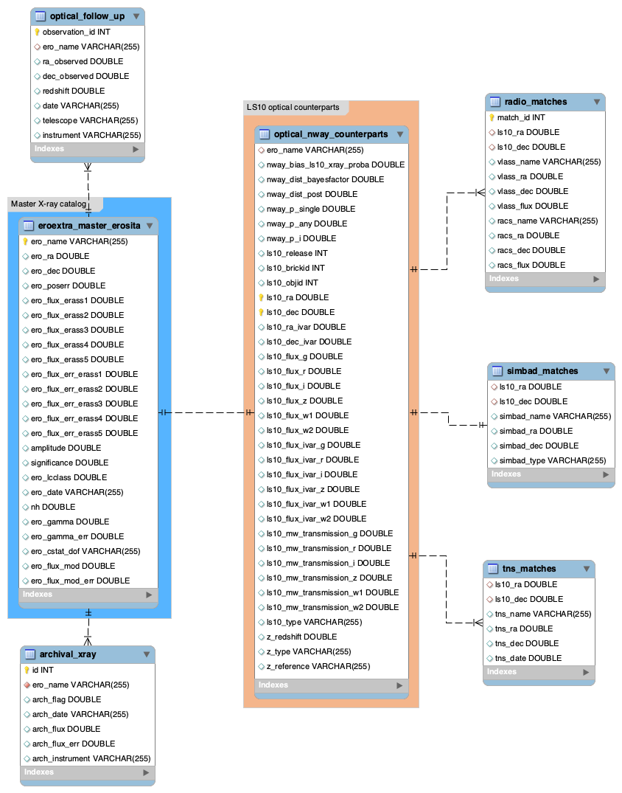

# eRO-ExTra SQL Database

This repository contains the **SQL database for the eRO-ExTra catalog**.  
More information about the catalog can be found in the project repository:

## Database Structure
The **database structure** is visualized in the relationship schema diagram below:

